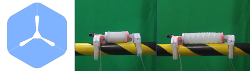
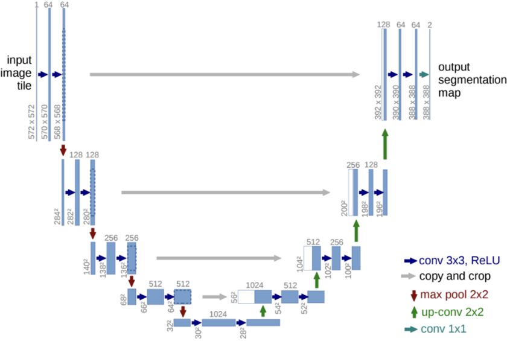
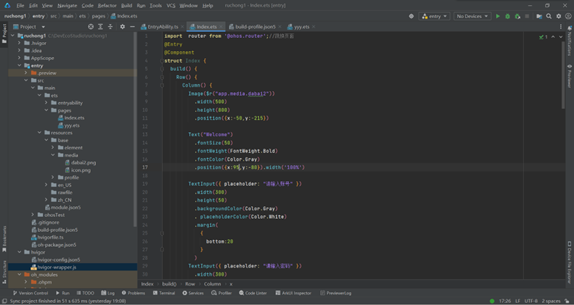

# 基于OpenHarmony开发的地下线缆巡检折纸软体机器人
## 一、背景介绍
随着输变电技术的发展，需要配套相符合的电力设备。我国现行的输电线路巡视检查方式主要是定期巡查和故障定点修理相结合。在定期巡查期间，工作人员需要对输电线路逐步巡查。但是由于输电线路的不断扩张，易损伤段线路的固定巡检工作量也随之剧增，以致定期巡检模式也不能满足建设电网的需求。 \
因此，传统的人力巡检和单一功能的巡检方式不能满足现有输电线路检查维修的需要。同时，繁杂的输电线路环境增大了巡视检查的难度，因此开发新型的线路巡检机器人是有必要的，因此我们团队研发了这款产品。
## 二、社会痛点
对于国内老城区电缆隧道内部环境封闭且复杂的情况，目前巡检的主要方式是人工巡检，根据调研情况，人工巡检一段35-55m的老城区线缆地段需要花费1h-1.5h。并且我们对相关的城市管理局进行调查，有80%以上的线缆巡检工人不愿意对老城区的杂乱线缆进行巡检，因其工作效率低、成本高、巡检环境差、巡检流程繁杂并且安全难以保证。
## 三、项目架构
目前城市中大量使用地下电缆。地下管道空间狭小，线路复杂，一旦发生故障，无法准确的找到故障地点，多模态折纸软体机器人能快速进行地底电缆的故障检修，减少停电造成的经济损失。 \
整个巡检过程机器不会对设备造成损坏，减少了维修人员的工作量，降低运维成本，加速对地下线缆的故障排查。为用户提供“巡-检-存-查”一站式线缆巡检解决方案。 \
### 1.采用并行气囊的多腔室控制实现多维度运动
本团队在软体复合方面不同于其他同类产品的串行气囊模式，而是采用了并行控制的多腔室结构，可以通过多维度的步态规划，控制各个腔室的充放气组合，实现折纸机器人的三维立体运动，使软体机器人在进行地下复杂环境的巡检作业时，能拥有合适的位移姿态进行障碍的规避，完成正常稳定的巡检工作。
### 2.基于超弹性材料的软体制作
本团队利用Ogden超弹性材料作为软体材料，并且自主设计模块化可拆卸模具和硅胶材料配方，完成多维度软体折纸驱动器以及环抱式软体脚部的制作验证，具有抗拉压、抗撕扯、抗震动、性能稳定，不容易因外力而永久变形的特性。
### 3.PID-PWM气压调节闭环控制系统
机器人分布式气压控制系统，采用多个微处理器，可快速的实现多线程的运行，能实现复杂算法控制和程序控制。灵活应对环境，不同的微处理器控制前进、转弯、转身等不同的动作。除此之外，控制系统也进行了测试分析，对于阶跃信号，在可允许的0.005Mpa的误差范围内，在1.06s的时间内系统达到了平衡，反应可以满足要求，超调量为0.0334Mpa，符合在气动软体肌肉设计的安全气压范围之内。

### 4.基于U-Net卷积神经网络的线缆表面多样化破损检测模型
针对地下线缆的复杂背景和破损情况的复杂容易造成识别不准确，本团队设计了一种基于U-Net卷积神经网络的破损检测方法,可实现线缆表面缺陷的自动化检测分类并提高线缆表面破损检测效率与精度。基于U-Net网络架构，可以从网络结构层次和超参数两个方面进行优化，从而达到提升模糊线缆像素的分割效果。采⽤Binary Cross Entropy损失函数，Adam优化器，使原始特征信息被完整保留，识别LOSS值低于0.05，实现高效、无损、快速的大规模电缆外表面多样化异常检测。
### 5.基于华为云Astro的地底管网监控平台设计
我们团队基于Astro对地底管网监控平台进行了设计，可以将软体折纸机器人在管道内收集到的巡检状态、位置信息、历史数据、寿命评估等数据信息进行展示，按照一定的交互系统设计，进行各个数据模块之间的转换。
并且，我们的巡检软体机器人会在工作的区域内进行多次巡检作业，在这些反复的巡检中获取该区域的地底录像，图片、等各种数据信息，以此构建起对应的管网数据库，再由这些管网数据库组成完全的地底管网监控系统。

## 四、开发环境
1.OpenHarmony 3.2 relase \
2.anaconda-py3.7-64 \
3.pytorch1.5.1 -gpu+
## 五、设计思路
本款多模态复合折纸软体机器人利用多模态折纸拟合和硅胶配方创新，制作软体折纸驱动器，实现单个驱动器可以弯曲及伸缩，为机器人实现转弯、爬行、抬头等多个动作，适应地底的复杂环境。 \
本项目通过位姿传感器获取机器人实时姿态信息，搭配PID-PWM气压可调节控制，对气压进行更精细的调控，完成驱动器步态规划，实现稳定的闭环控制。 \
头部搭载红外夜视摄像头，可获取巡检录像及过程情况，并自主研发了基于U-net卷积神经网络的线缆破损检测模型，对巡检图片进行破损识别，识别准确度在95.0%以上。 \
同时，我们开发了基于华为云Astro轻应用构建区域地底管网监控系统，利用华为云Astro轻应用特性，可以针对不同用户定制不同数字化展示界面，并且可获取接入的巡检机器人数据，通过对区域的多次巡检获取数据信息，构建区域地底管网数据库，实现线缆破损预测和应对突发情况。 \
为了是实现线缆巡检工人在巡检时更直观便捷得看到地底巡检信息，我们基于OpenHarmony开发了智能巡检系统。可以通过手机设备直观地看到机器人的巡检情况以及机器人自身的状态，在检测到线缆破损时及时发出警报，大大提高线缆巡检工人的工作效率。 \
整个巡检过程机器人不会对设备造成损坏，减少了维修人员的工作量，降低运维成本，加速对地下线缆的故障排查。为用户提供“巡-检-存-查”一站式线缆巡检解决方案。 \

## 六、实现原理
### 1.多腔室软体驱动器的控制设计
本团队在软体复合方面不同于其他同类产品的串行气囊模式，而是采用了并行控制的多腔室结构，可以通过多维度的步态规划，控制各个腔室的充放气组合，实现折纸机器人的三维立体运动，并通过BearPi下发多维运动控制指令，使软体机器人在进行地下复杂环境的巡检作业时，能拥有合适的位移姿态进行障碍的规避，完成正常稳定的巡检工作。 \
 \
 \

### 2.基于ModelArts开发的线缆表面多样化破损检测模型
针对地下线缆的复杂背景和破损情况的复杂容易造成识别不准确，本团队设计了一种基于U-Net卷积神经网络的破损检测方法,可实现线缆表面缺陷的自动化检测分类并提高线缆表面破损检测效率与精度。基于U-Net网络架构，可以从网络结构层次和超参数两个方面进行优化，从而达到提升模糊线缆像素的分割效果。采⽤Binary Cross Entropy损失函数，Adam优化器，使原始特征信息被完整保留，识别LOSS值低于0.05，实现高效、无损、快速的大规模电缆外表面多样化异常检测。 \
 \
1.该模型基于U-Net网络架构，可以从网络结构层次和超参数两个方面进行优化，从而达到提升模糊线缆像素的分割效果。 \
2.原始特征信息留存度高，不易失真。该模型将图⽚统⼀预处理为(224,224)⼤⼩，8:2划分为训练集和测试集，采⽤Binary Cross Entropy损失函数，Adam优化器，使原始特征信息被完整保留。 \
3.将模型部署在ModelArts上，进行大量训练保证识别准确率。共训练350轮，采⽤学习率下降策略，初始学习率为 1e-3 ，在150轮时学习率调整为 1e-4 ，在 250轮时学习率调整为 1e-5 ，大大提高了分割精度和效率，相较于其他的分割方法会更好。 \
4.该模型与原始U-Net模型相比，可以使用较少的数据完成端到端的训练，极好地平衡了系统的识别时间和识别精度,能实现高效、无损、快速的大规模电缆外表面多样化异常检测。 \
 \

### 3.基于华为云Astro轻应用的地底管网监控平台设计
地底管网监控平台包括：区域地底管网数据库、巡检机器人状态信息与区域历史巡检信息。
我们团队基于Astro对地底管网监控平台进行了设计，利用低代码程序，可以快捷便利地完成监控界面制作，可以将软体折纸机器人在管道内收集到的巡检状态、位置信息、历史数据、寿命评估等数据信息进行展示，按照一定的交互系统设计，进行各个数据模块之间的转换，以提供定制化服务。
并且，我们的巡检软体机器人会在工作的区域内进行多次巡检作业，在这些反复的巡检中获取该区域的地底录像，图片、等各种数据信息，以及巡检机器人状态与区域历史巡检信息以此构建起对应的管网数据库，再由这些管网数据库组成完全的地底管网监控系统。实现巡检信息的可视化与数据化。
 \
 \
 
### 4.OpenHarmony开发
我们采用ArkTS语言进行开发，在开发的过程中遇到了很多问题，比如预览画面和真机调试画面无法弹性适配、颜色效果不一样、团队分工开发效率不高等问题，但经过队员的不断讨论与坚持不懈，这些问题最后都迎刃而解，最后我们将代码进行汇总，来实现完整的前端界面。
 \

## 七、功能介绍
### 1.登录注册
每个用户有对应的地下巡检机器人，用户在使用APP时首先进行登录注册，只有账号和密码与我们的后端MySQL数据库相对应时，才可以进行登录。
### 2.巡检信息首页
操作人员登陆账号进入APP以后，可以直观地看到机器人的巡检信息，以及巡检机器人的操作以及维护指南。 \
  \
  \
 
### 3.控制页面
巡检人员打开APP进行等下线缆巡检时，可以直接点击主页导航栏里的控制按钮，进入到地下线缆巡检机器人的控制页面，通过点击不同的按钮来控制机器人的运动，来实现机器人的地下线缆巡检。 \
 
## 八、应用场景
### 1.老城区的地下线缆巡检
目前中国还有13万个老城区，这些老城区线路错综复杂，地下线缆老化严重，抢修苦难，线缆检测人员很难进入管道进行线缆巡检，因此老城区的地底线缆巡检是我们主要的应用场景。
### 2.一些大型机械的内部线缆巡检
我国目前有越来越多的高精尖的大型器械，但是这些大型器械一旦线路出现问题，维修人员是很难直接进入内部进行抢修的，这时可以用到我们的巡检机器人直接进入其中找到破损的线缆，再让维修人员进入，这样既提高了工作效率，又减少了成本投入。
## 九、产品价值
### 1.简化人工检测流程，缓解地下线缆人工巡检招工难，成本高，巡检环境差，巡检流程繁杂等痛点。
传统的线缆巡检主要是人工巡检，需要进行大量的重复性质工作，工作环境恶劣，数据存档及应用繁琐。 \
机器人检测能有效降低人工工作量，机器人能够按着预设的数据采集要求及图像拍摄要求进行信息获取，数据更具有客观性，机器人不受外界因素干扰。
### 2.采用小型轻质多自由度软体机器人作为载体，更能适应复杂的地下巡检环境。
我们的产品属于软体机器人，相较于市场上已有的机器人，我们的机器人体型小，重量轻，内部采用软体驱动方式，相比于市场上已有的机械式刚性机器人，能够适应更多复杂的环境。 \
软体机器人可以在更为狭小的廊道内进行巡检作业，比如：目前老城区改建的地区，其管道直径小，我们的机器人可以克服这一难题。
### 3.提供“巡-检-存-查”一站式线缆巡检服务：线缆巡检数据回传、储存、分析、可视化，掌握地下线缆状态信息，加速城市地下电缆的安全隐患排查。
我们产品提供了产品的智能化服务，我们能够系统地储存并分析数据，从而能够有效将地下管线数据进行整理收集。此外还会针对线缆的表层破损情况、地下温度、湿度、线缆内部电压周期平均值，来进行线缆故障分析、维修方案建议、使用寿命预测、破损位置预估等职能服务。
